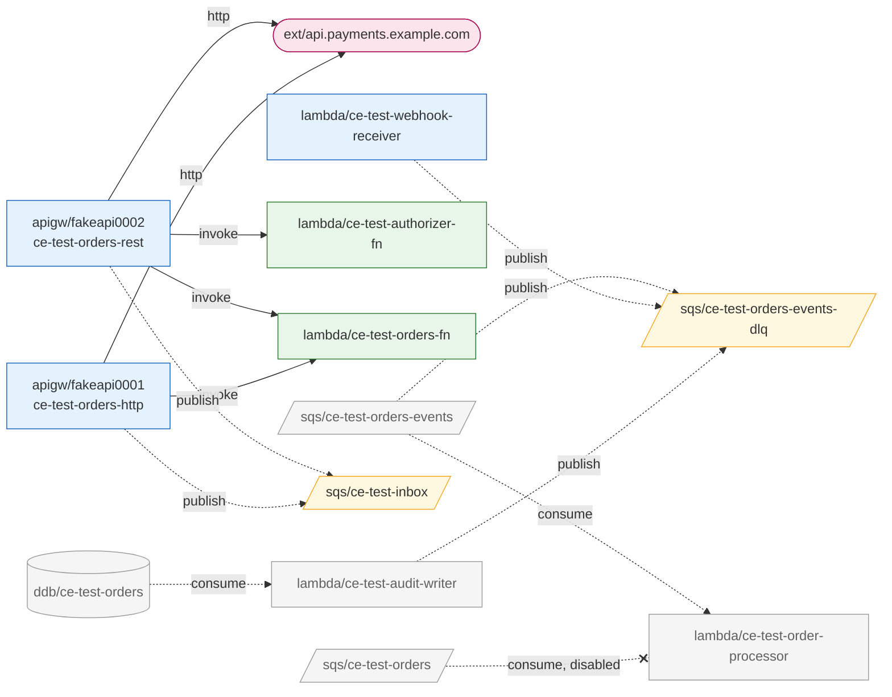

# M1 — Real-account validation and Floci round trip

**Date:** 2026-09-13 · **Scope:** discovery (ECS, SQS, DynamoDB, Lambda, IAM)
against a real AWS account, then a round trip through a local Floci ·
**Scripts:** [`spikes/m1/`](../../spikes/m1/)

## Verdict

**Discovery holds against a real account, and the shipped IAM policy is exactly
sufficient.** A scan with *only* `policies/cloud-echo-scanner.json` produced an
inventory identical, field for field and Raw included, to one taken with full
admin access. Seven defects surfaced, all now fixed with a regression test each;
none was structural.

The Floci round trip (scan AWS → rebuild in Floci → scan Floci → compare) says
the inventory is now enough to rebuild what was tested. It also produced the
first concrete list of what the M2 materializer must handle that no document
predicted.

## What was created

A deliberately awkward topology, cheap enough to leave running: nothing executes
compute. ECS services have `desiredCount: 0`, no function is ever invoked, and
DynamoDB is on-demand or at the 1/1 provisioned floor. RDS and ElastiCache were
**not** created; they bill by the hour.

| Resource | What it exercises |
| --- | --- |
| 13 ECS services in one cluster | real `ListServices` pagination (10 per page) and `DescribeServices` batching |
| a service with the same name in two clusters | cluster-scoped ids |
| task definitions at revisions 1 and 2, both in use | one describe per distinct revision |
| a task role under an IAM path (`/ce-test/`) | the path must not reach the id |
| a DynamoDB table and an SQS queue both named `ce-test-orders` | the ambiguity the linker must not guess at |
| a Lambda whose role was deleted after creation | the `dangling-reference` warning |
| env vars carrying a DB password, a token, a webhook; a `--smtp-password=` flag | redaction against real API responses |
| a mapping to an alias, a disabled mapping, a stream mapping with an on-failure destination | Lambda Tier-1 inputs |
| a permissions boundary, an explicit `Deny`, a policy value with `+` and a space | IAM decoding and Tier-3 inputs |
| an ECS execution role | must **not** be collected |

## Results

| Check | Result |
| --- | --- |
| Scan, admin credentials | 42 resources, 9 s, one expected `dangling-reference` warning |
| Field-level checker ([`check-inventory.py`](../../spikes/m1/check-inventory.py)) | **46 / 46** |
| Scan with only the shipped policy vs admin | **0 differences** across 42 resources, Raw included |
| Two scans minutes apart | identical apart from scan id and timestamps |
| Scan with `iam:GetRole` and `lambda:GetPolicy` denied | 33 resources kept, scan completed, denials reported (see bug 4) |
| AWS error codes vs `isAccessDenied` | IAM `AccessDenied` 403, Lambda `AccessDeniedException` 403 — both matched |
| Round trip: seed Floci from the AWS inventory | 58 calls, **0 failures**, 19 s; Floci ready in 541 ms |
| Round trip: compare AWS vs Floci inventories | 98 differences in 26 groups, **every one explained** (below) |

## Defects found and fixed

Each was reproduced first, fixed, and pinned by a test verified to fail without
the fix.

**1. SQS queues silently truncated past 1000.** `ListQueues` returns `NextToken`
only when `MaxResults` is set; without it AWS returns up to 1000 queues and no
sign there are more. Confirmed against the real API: the same call returns a
token only once `MaxResults` is present. The collector now always sends 1000,
and the fixture only answers requests that carry it.

**2. A live event source mapping read as disabled.** A mapping caught mid-update
reports `Updating`, and the two-state rule (`Enabled`/`Enabling` → true) recorded
it as disabled — reproduced by changing a live mapping's batch size and scanning
immediately; 20 s later it was `Enabled` again. In a deploy-heavy account the
linker would have dropped a real edge. `enabled` is now tri-state (`true`,
`false`, `null` when the state cannot say) with a `transitional` flag.

**3. The inventory could not be audited with grep.** `json.Marshal` escaped every
`<redacted:…>` marker to `\u003credacted:…\u003e` and every `&` to `\u0026`, so
`grep '<redacted' inventory.json` — the obvious way to see what a scan withheld —
returned nothing. Spec and Raw are now encoded without HTML escaping.

**4. One missing permission became one warning per resource.** Two denied actions
across ten resources printed ten lines of SDK error text; an account with 200
functions would print 200. The summary now groups denials by IAM action with a
count and names exactly what to grant. Findings about a specific resource are
still listed one per line.

**5. `AWS_ENDPOINT_URL` was honoured silently.** Useful — it is how the round trip
scans Floci — and a trap: a shell with the variable left exported from emulator
work would scan the emulator while the output named an AWS account. The scan now
prints any endpoint override, including service-specific ones. This also gave
`NewSession` its first test.

**6. Redaction was not idempotent.** Scanning an environment seeded from a
redacted inventory re-redacted two of three markers and counted them as new, so
`redacted` stopped meaning "what cloud-echo refused to copy out of AWS". Markers
are now left alone.

**7. The spec lacked what a rebuild needs.** The seeder had to read three things
from Raw: DynamoDB provisioned throughput, ECS `dependsOn` conditions, and the
full log configuration. All three are now in the spec, and the seeder no longer
touches Raw for them. Log driver options can carry credentials (`splunk-token`,
FireLens API keys), so they are redacted like env vars — in Raw too.

Tooling, not product: the M0 Floci script created a Docker network by name on
every run, and Docker accepted duplicates — three networks called `ce-m1`, then
`docker run --network` refused to choose. That bears directly on M2 (below).

## Floci fidelity

Every difference between the AWS inventory and the one scanned back from Floci,
grouped:

| Difference | Class | Consequence |
| --- | --- | --- |
| tags absent | prototype seeder skips them | none |
| SQS `url` is `http://localhost:4566/…` | inherent: the URL embeds the endpoint | **workload env must be rewritten** |
| DynamoDB stream ARN differs | inherent: the label is a creation timestamp | **resolve per environment** |
| ECS task def `command`, `dependsOn`, `logConfiguration`, port `name` absent | Floci does not *return* them | describe-only: a real `RunTask` applied `command` (container `Cmd` verified). `dependsOn`/log runtime behaviour unverified |
| ECS service `schedulingStrategy`, `roleArn` absent; `taskDefinition` as `family:rev`, not ARN | Floci response shape | none — ids normalize both forms |
| IAM permissions boundary absent (so the boundary policy is never discovered) | Floci does not support boundaries | local IAM cannot reproduce effective permission |
| AWS-managed policies are stubs with `Action: "*"` | Floci | locally, those roles can do anything |
| mapping to alias `live` stored without the qualifier | Floci drops ESM qualifiers | locally the mapping invokes `$LATEST` |
| mapping `startingPosition`, function `LoggingConfig` absent | Floci response shape | none for linking |
| `redacted` absent in the Floci scan | correct after fix 6: markers are not secrets | none |

**Asymmetry worth stating.** The linker and planner consume the *AWS* inventory,
so none of these contaminates the graph. What they break is using a scan of
Floci to confirm what the materializer built — for that, the materializer must
verify by exercising (run the task, send the message), not by describing.

## Consequences for M2 and M3

- **Rewrite queue URLs.** `QUEUE_URL=https://sqs.<region>.amazonaws.com/…` points
  at production until replaced. Measured justification for `${ref:sqs/x.url}` in
  [04-blueprint.md](../04-blueprint.md).
- **Resolve stream ARNs at materialization.** Never copy them.
- **Identify a mapping by what it connects** — source, function, qualifier — not
  by its UUID, which is minted per environment and per re-creation.
- **Aliases and versions are not in the inventory.** The seeder had to infer
  `live` from a mapping's qualifier. See [Q13](../09-open-questions.md).
- **Task definition revision numbers cannot be reproduced** by registering once;
  blueprint identity must not depend on them.
- **Find Docker networks by label and id, never by name alone.**
- **Local IAM is shape, not enforcement.** No boundaries, permissive AWS-managed
  stubs. Confirms the leaning in [Q6](../09-open-questions.md).
- **Redacted values need local substitutes.** Seeded verbatim, a marker is at
  least obviously not a secret; the planner still has to put something runnable
  there (`secrets:` in the blueprint).

## Not tested

- RDS, ElastiCache, API Gateway — cost, and no collectors yet.
- A Lambda environment encrypted with a customer KMS key — a key costs money; the
  `unreadable` path is covered by fixtures only.
- Pagination at real scale beyond ECS services (e.g. >1000 queues); the mechanism
  was confirmed, the scale was not.
- Cross-account role references — single account.
- Throttling on a large account.
- `--out /dev/stdout` does not work: the atomic write stages a temp file in the
  target's directory.

## API Gateway round

**Date:** 2026-09-13 (second round) · The same method, applied to the API
Gateway collectors: real payloads read *before* the collector was written, then
a real-account scan, a least-privilege comparison, a scope probe, and a Floci
round trip. Topology: one REST API and one HTTP API, each fronting a Lambda (one
route through an alias), a direct SQS integration with a role, a mock and an
external HTTP backend, plus a TOKEN and a JWT authorizer and stages with
variables.

| Check | Result |
| --- | --- |
| Scan, admin | 9 resources, 4 s, no warnings |
| Field-level checker ([`check-apigw.py`](../../spikes/m1/check-apigw.py)) | **29 / 29** |
| Scan with only the shipped policy vs admin | **0 differences** |
| Scope probe with the scanner's credentials ([`22-probe-scope.sh`](../../spikes/m1/22-probe-scope.sh)) | **7 / 7** — definitions readable; API key values, usage plans, domains, client certificates refused |
| Round trip: seed Floci | 43 calls, 0 failures |

What reading real payloads first changed, before any code existed:

- **`embed=methods` works** on `GetResources`, so `GetMethod`/`GetIntegration`
  per method were dropped from the design.
- **API names are not unique**; ids are API ids.
- **v2 repeats the SQS pagination trap**: no `NextToken` without `MaxResults`.
- **The REST resource policy is doubly escaped**, including `\/`, which
  `strconv.Unquote` cannot read.
- **JWT authorizers require a real OIDC issuer** — API Gateway fetches its
  discovery document at creation.
- **`apigateway:GET` on `"*"` would grant API key values** → scoped policy,
  [ADR-0008](../adr/0008-scope-coarse-iam-actions.md).

Found and fixed during the round:

- **Stages and authorizers were in arrival order.** The same HTTP API scanned from
  AWS and from Floci listed its stages in opposite orders. Both are now sorted,
  with a test that serves them reversed. Comparing two implementations of one API
  is what exposed an order dependency no single-source test could.
- **A fixture written from CLI output deserialized to nothing.** API Gateway v1
  lists are `item` on the wire and `items` in the CLI; recorded in CONTRIBUTING.
- **IAM would have reported `arn:aws:iam::*:user/*`** — "use the caller's
  credentials" — as a role in another account. Non-role ARNs are now skipped.

Floci fidelity for API Gateway: it accepts the whole control plane but
**does not implement `embed=methods`** (methods are stored — `GetMethod` returns
them — just not embedded), **drops integration `credentials`** in v1 and v2 and
the **v2 integration subtype**, and **does not store the REST resource policy**.
None of it touches the graph, which is built from the AWS inventory; all of it
means a local SQS direct integration will not work as in AWS, and that a scan of
Floci cannot verify what was built.

## Linker round (Tier 1)

**Date:** 2026-09-13 (third round) · The first linker tier — relationships the
account declares — and flow classification, run on the real account with both
earlier topologies up at once.

Seven requirements in [03-linker.md](../03-linker.md) changed before any code,
each recorded there with its reason: edge direction defined as causality; nodes
defined (task definitions, roles and clusters are configuration, not nodes);
nothing invented for targets outside the inventory; ids derived from ARNs trusted
only in the scanned account and region; a resource policy corroborates and never
creates an edge; entrypoints are anything with an external trigger, not "no
inbound edges"; and flow is order-free, with **sync taking precedence** and
**unreached replacing orphan**.

| Check | Result |
| --- | --- |
| Real account: scan → graph | 48 resources → 30 nodes, 13 edges, 0 findings, no warnings |
| Expected edges and flows ([`check-graph.py`](../../spikes/m1/check-graph.py), written before looking at the output) | **26 / 26** |
| Same checker against the sanitized fixture | **26 / 26** — sanitizing kept the meaning |
| Mutations of the linker's semantic decisions | **7 / 7** caught by named tests |

The real graph, as `cloud-echo graph --format mermaid` draws it (17 nodes
with no edge at all — mostly idle ECS services — left out here):



Things worth reading in it:

- `REST → orders-fn` carries **two independent pieces of evidence**: the route's
  integration and the function's resource policy.
- `webhook-receiver` is an **entrypoint** because its resource policy names an API
  that is not in the inventory — a caller from outside the graph.
- The `orders-events → order-processor` pipeline is **unreached**, and alive: the
  service that publishes to the queue does so through the SDK, which only Tier 2
  and Tier 3 will see. That is the case "orphan" would have misreported as dead.

**Incident worth recording.** The first graph run failed 12 of 26 checks: the API
Gateway topology had been torn down between rounds. The checker, written from
what the scripts build, failed loudly on missing nodes instead of passing on a
partial account. Recreated and re-run: 26/26.

**Third golden account.** The real inventory, sanitized by
[`sanitize-inventory.py`](../../spikes/m1/sanitize-inventory.py) — Raw dropped,
the account id and 15 account-specific identifiers replaced with stable fakes,
resources outside the test topology removed — is now `internal/linker/testdata/real-m1`.
The script refuses to write if any original identifier survives, and an
independent grep confirmed none did.

## Reproducing

```bash
cd spikes/m1
go build -o .work/cloud-echo ../../cmd/cloud-echo
./10-aws-create.sh           # topology (re-runnable)
./11-aws-scanner-roles.sh    # least-privilege and partial-deny roles
./.work/cloud-echo scan --profile <p> --out .work/inventory-aws.json
python3 check-inventory.py .work/inventory-aws.json
./21-scan-as.sh ce-test-scanner .work/inventory-least.json
python3 diff-inventory.py .work/inventory-aws.json .work/inventory-least.json
./12-aws-apigw-create.sh     # API Gateway topology
python3 check-apigw.py .work/inventory-aws.json
./22-probe-scope.sh          # the policy cannot read API key values
./.work/cloud-echo graph --inventory .work/inventory-aws.json --out .work/graph-aws.json --format json >/dev/null
python3 check-graph.py .work/graph-aws.json
./30-floci-roundtrip.sh      # seed Floci, scan it, compare
python3 group-diff.py .work/inventory-aws.json .work/inventory-floci.json
./90-aws-teardown.sh         # lists, asks, then removes every ce-test- resource
```

Idle cost is effectively zero; the one continuous activity is the enabled SQS
mapping's long-polling, well inside the SQS free tier.
