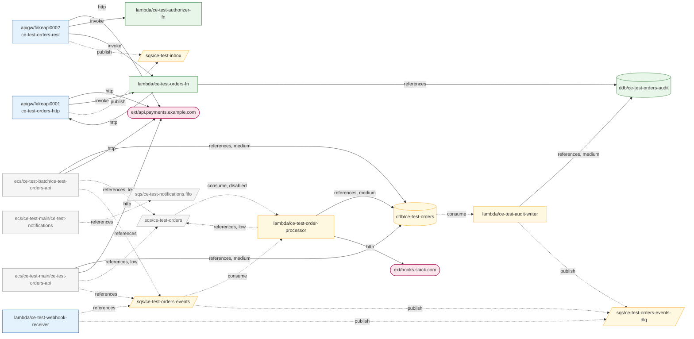

# M1 — Real-account validation and Floci round trip

**Date:** 2026-09-13 · **Scope:** discovery (ECS, SQS, DynamoDB, Lambda, IAM)
against a real AWS account, then a round trip through a local Floci ·
**Scripts:** [`spikes/m1/`](../../spikes/m1/)

## Verdict

**Discovery holds against a real account, and the shipped IAM policy is exactly
sufficient.** A scan with *only* `policies/cloud-echo-scanner.json` produced an
inventory identical, field for field and Raw included, to one taken with full
admin access. Seven defects surfaced, all now fixed with a regression test each;
none was structural.

The Floci round trip (scan AWS → rebuild in Floci → scan Floci → compare) says
the inventory is now enough to rebuild what was tested. It also produced the
first concrete list of what the M2 materializer must handle that no document
predicted.

## What was created

A deliberately awkward topology, cheap enough to leave running: nothing executes
compute. ECS services have `desiredCount: 0`, no function is ever invoked, and
DynamoDB is on-demand or at the 1/1 provisioned floor. RDS and ElastiCache were
**not** created; they bill by the hour.

| Resource | What it exercises |
| --- | --- |
| 13 ECS services in one cluster | real `ListServices` pagination (10 per page) and `DescribeServices` batching |
| a service with the same name in two clusters | cluster-scoped ids |
| task definitions at revisions 1 and 2, both in use | one describe per distinct revision |
| a task role under an IAM path (`/ce-test/`) | the path must not reach the id |
| a DynamoDB table and an SQS queue both named `ce-test-orders` | the ambiguity the linker must not guess at |
| a Lambda whose role was deleted after creation | the `dangling-reference` warning |
| env vars carrying a DB password, a token, a webhook; a `--smtp-password=` flag | redaction against real API responses |
| a mapping to an alias, a disabled mapping, a stream mapping with an on-failure destination | Lambda Tier-1 inputs |
| a permissions boundary, an explicit `Deny`, a policy value with `+` and a space | IAM decoding and Tier-3 inputs |
| an ECS execution role | must **not** be collected |

## Results

| Check | Result |
| --- | --- |
| Scan, admin credentials | 42 resources, 9 s, one expected `dangling-reference` warning |
| Field-level checker ([`check-inventory.py`](../../spikes/m1/check-inventory.py)) | **46 / 46** |
| Scan with only the shipped policy vs admin | **0 differences** across 42 resources, Raw included |
| Two scans minutes apart | identical apart from scan id and timestamps |
| Scan with `iam:GetRole` and `lambda:GetPolicy` denied | 33 resources kept, scan completed, denials reported (see bug 4) |
| AWS error codes vs `isAccessDenied` | IAM `AccessDenied` 403, Lambda `AccessDeniedException` 403 — both matched |
| Round trip: seed Floci from the AWS inventory | 58 calls, **0 failures**, 19 s; Floci ready in 541 ms |
| Round trip: compare AWS vs Floci inventories | 98 differences in 26 groups, **every one explained** (below) |

## Defects found and fixed

Each was reproduced first, fixed, and pinned by a test verified to fail without
the fix.

**1. SQS queues silently truncated past 1000.** `ListQueues` returns `NextToken`
only when `MaxResults` is set; without it AWS returns up to 1000 queues and no
sign there are more. Confirmed against the real API: the same call returns a
token only once `MaxResults` is present. The collector now always sends 1000,
and the fixture only answers requests that carry it.

**2. A live event source mapping read as disabled.** A mapping caught mid-update
reports `Updating`, and the two-state rule (`Enabled`/`Enabling` → true) recorded
it as disabled — reproduced by changing a live mapping's batch size and scanning
immediately; 20 s later it was `Enabled` again. In a deploy-heavy account the
linker would have dropped a real edge. `enabled` is now tri-state (`true`,
`false`, `null` when the state cannot say) with a `transitional` flag.

**3. The inventory could not be audited with grep.** `json.Marshal` escaped every
`<redacted:…>` marker to `\u003credacted:…\u003e` and every `&` to `\u0026`, so
`grep '<redacted' inventory.json` — the obvious way to see what a scan withheld —
returned nothing. Spec and Raw are now encoded without HTML escaping.

**4. One missing permission became one warning per resource.** Two denied actions
across ten resources printed ten lines of SDK error text; an account with 200
functions would print 200. The summary now groups denials by IAM action with a
count and names exactly what to grant. Findings about a specific resource are
still listed one per line.

**5. `AWS_ENDPOINT_URL` was honoured silently.** Useful — it is how the round trip
scans Floci — and a trap: a shell with the variable left exported from emulator
work would scan the emulator while the output named an AWS account. The scan now
prints any endpoint override, including service-specific ones. This also gave
`NewSession` its first test.

**6. Redaction was not idempotent.** Scanning an environment seeded from a
redacted inventory re-redacted two of three markers and counted them as new, so
`redacted` stopped meaning "what cloud-echo refused to copy out of AWS". Markers
are now left alone.

**7. The spec lacked what a rebuild needs.** The seeder had to read three things
from Raw: DynamoDB provisioned throughput, ECS `dependsOn` conditions, and the
full log configuration. All three are now in the spec, and the seeder no longer
touches Raw for them. Log driver options can carry credentials (`splunk-token`,
FireLens API keys), so they are redacted like env vars — in Raw too.

Tooling, not product: the M0 Floci script created a Docker network by name on
every run, and Docker accepted duplicates — three networks called `ce-m1`, then
`docker run --network` refused to choose. That bears directly on M2 (below).

## Floci fidelity

Every difference between the AWS inventory and the one scanned back from Floci,
grouped:

| Difference | Class | Consequence |
| --- | --- | --- |
| tags absent | prototype seeder skips them | none |
| SQS `url` is `http://localhost:4566/…` | inherent: the URL embeds the endpoint | **workload env must be rewritten** |
| DynamoDB stream ARN differs | inherent: the label is a creation timestamp | **resolve per environment** |
| ECS task def `command`, `dependsOn`, `logConfiguration`, port `name` absent | Floci does not *return* them | describe-only: a real `RunTask` applied `command` (container `Cmd` verified). `dependsOn`/log runtime behaviour unverified |
| ECS service `schedulingStrategy`, `roleArn` absent; `taskDefinition` as `family:rev`, not ARN | Floci response shape | none — ids normalize both forms |
| IAM permissions boundary absent (so the boundary policy is never discovered) | Floci does not support boundaries | local IAM cannot reproduce effective permission |
| AWS-managed policies are stubs with `Action: "*"` | Floci | locally, those roles can do anything |
| mapping to alias `live` stored without the qualifier | Floci drops ESM qualifiers | locally the mapping invokes `$LATEST` |
| mapping `startingPosition`, function `LoggingConfig` absent | Floci response shape | none for linking |
| `redacted` absent in the Floci scan | correct after fix 6: markers are not secrets | none |

**Asymmetry worth stating.** The linker and planner consume the *AWS* inventory,
so none of these contaminates the graph. What they break is using a scan of
Floci to confirm what the materializer built — for that, the materializer must
verify by exercising (run the task, send the message), not by describing.

## Consequences for M2 and M3

- **Rewrite queue URLs.** `QUEUE_URL=https://sqs.<region>.amazonaws.com/…` points
  at production until replaced. Measured justification for `${ref:sqs/x.url}` in
  [04-blueprint.md](../04-blueprint.md).
- **Resolve stream ARNs at materialization.** Never copy them.
- **Identify a mapping by what it connects** — source, function, qualifier — not
  by its UUID, which is minted per environment and per re-creation.
- **Aliases and versions are not in the inventory.** The seeder had to infer
  `live` from a mapping's qualifier. See [Q13](../09-open-questions.md).
- **Task definition revision numbers cannot be reproduced** by registering once;
  blueprint identity must not depend on them.
- **Find Docker networks by label and id, never by name alone.**
- **Local IAM is shape, not enforcement.** No boundaries, permissive AWS-managed
  stubs. Confirms the leaning in [Q6](../09-open-questions.md).
- **Redacted values need local substitutes.** Seeded verbatim, a marker is at
  least obviously not a secret; the planner still has to put something runnable
  there (`secrets:` in the blueprint).

## Not tested

- Every other service in the target stack's supporting list (ECR, SNS, EC2,
  ELBv2, Secrets Manager, SSM) — no collectors yet. API Gateway, RDS and
  ElastiCache have their own rounds below.
- A Lambda environment encrypted with a customer KMS key — a key costs money; the
  `unreadable` path is covered by fixtures only.
- Pagination at real scale beyond ECS services (e.g. >1000 queues); the mechanism
  was confirmed, the scale was not.
- Cross-account role references — single account.
- Throttling on a large account.
- `--out /dev/stdout` does not work: the atomic write stages a temp file in the
  target's directory.

## API Gateway round

**Date:** 2026-09-13 (second round) · The same method, applied to the API
Gateway collectors: real payloads read *before* the collector was written, then
a real-account scan, a least-privilege comparison, a scope probe, and a Floci
round trip. Topology: one REST API and one HTTP API, each fronting a Lambda (one
route through an alias), a direct SQS integration with a role, a mock and an
external HTTP backend, plus a TOKEN and a JWT authorizer and stages with
variables.

| Check | Result |
| --- | --- |
| Scan, admin | 9 resources, 4 s, no warnings |
| Field-level checker ([`check-apigw.py`](../../spikes/m1/check-apigw.py)) | **29 / 29** |
| Scan with only the shipped policy vs admin | **0 differences** |
| Scope probe with the scanner's credentials ([`22-probe-scope.sh`](../../spikes/m1/22-probe-scope.sh)) | **7 / 7** — definitions readable; API key values, usage plans, domains, client certificates refused |
| Round trip: seed Floci | 43 calls, 0 failures |

What reading real payloads first changed, before any code existed:

- **`embed=methods` works** on `GetResources`, so `GetMethod`/`GetIntegration`
  per method were dropped from the design.
- **API names are not unique**; ids are API ids.
- **v2 repeats the SQS pagination trap**: no `NextToken` without `MaxResults`.
- **The REST resource policy is doubly escaped**, including `\/`, which
  `strconv.Unquote` cannot read.
- **JWT authorizers require a real OIDC issuer** — API Gateway fetches its
  discovery document at creation.
- **`apigateway:GET` on `"*"` would grant API key values** → scoped policy,
  [ADR-0008](../adr/0008-scope-coarse-iam-actions.md).

Found and fixed during the round:

- **Stages and authorizers were in arrival order.** The same HTTP API scanned from
  AWS and from Floci listed its stages in opposite orders. Both are now sorted,
  with a test that serves them reversed. Comparing two implementations of one API
  is what exposed an order dependency no single-source test could.
- **A fixture written from CLI output deserialized to nothing.** API Gateway v1
  lists are `item` on the wire and `items` in the CLI; recorded in CONTRIBUTING.
- **IAM would have reported `arn:aws:iam::*:user/*`** — "use the caller's
  credentials" — as a role in another account. Non-role ARNs are now skipped.

Floci fidelity for API Gateway: it accepts the whole control plane but
**does not implement `embed=methods`** (methods are stored — `GetMethod` returns
them — just not embedded), **drops integration `credentials`** in v1 and v2 and
the **v2 integration subtype**, and **does not store the REST resource policy**.
None of it touches the graph, which is built from the AWS inventory; all of it
means a local SQS direct integration will not work as in AWS, and that a scan of
Floci cannot verify what was built.

## Linker round (Tier 1)

**Date:** 2026-09-13 (third round) · The first linker tier — relationships the
account declares — and flow classification, run on the real account with both
earlier topologies up at once.

Seven requirements in [03-linker.md](../03-linker.md) changed before any code,
each recorded there with its reason: edge direction defined as causality; nodes
defined (task definitions, roles and clusters are configuration, not nodes);
nothing invented for targets outside the inventory; ids derived from ARNs trusted
only in the scanned account and region; a resource policy corroborates and never
creates an edge; entrypoints are anything with an external trigger, not "no
inbound edges"; and flow is order-free, with **sync taking precedence** and
**unreached replacing orphan**.

| Check | Result |
| --- | --- |
| Real account: scan → graph | 48 resources → 30 nodes, 13 edges, 0 findings, no warnings |
| Expected edges and flows ([`check-graph.py`](../../spikes/m1/check-graph.py), written before looking at the output) | **26 / 26** |
| Same checker against the sanitized fixture | **26 / 26** — sanitizing kept the meaning |
| Mutations of the linker's semantic decisions | **7 / 7** caught by named tests |

The real graph, as `cloud-echo graph --format mermaid` draws it (17 nodes
with no edge at all — mostly idle ECS services — left out here):


Things worth reading in it:

- `REST → orders-fn` carries **two independent pieces of evidence**: the route's
  integration and the function's resource policy.
- `webhook-receiver` is an **entrypoint** because its resource policy names an API
  that is not in the inventory — a caller from outside the graph.
- The `orders-events → order-processor` pipeline is **unreached**, and alive: the
  service that publishes to the queue does so through the SDK, which only Tier 2
  and Tier 3 will see. That is the case "orphan" would have misreported as dead.

**Incident worth recording.** The first graph run failed 12 of 26 checks: the API
Gateway topology had been torn down between rounds. The checker, written from
what the scripts build, failed loudly on missing nodes instead of passing on a
partial account. Recreated and re-run: 26/26.

**Third golden account.** The real inventory, sanitized by
[`sanitize-inventory.py`](../../spikes/m1/sanitize-inventory.py) — Raw dropped,
the account id and 15 account-specific identifiers replaced with stable fakes,
resources outside the test topology removed — is now `internal/linker/testdata/real-m1`.
The script refuses to write if any original identifier survives, and an
independent grep confirmed none did.

## Linker round (Tier 2)

**Date:** 2026-09-13 (fourth round) · Configuration values: what env vars,
command lines and stage variables name. The same topology, plus three values set
on the function behind both APIs by
[`12-aws-apigw-create.sh`](../../spikes/m1/12-aws-apigw-create.sh): an ARN, an API
invoke URL, and a queue URL in another account whose queue shares its name with
a local one.

Seven requirements in [03-linker.md](../03-linker.md#tier-2--configuration-value-scanning--high--medium--low-)
changed before any code: a reference says nothing about intent (a new
`references` kind, never `publish` or `write`); a reference folds into the edge
that states its intent; AWS endpoints, sidecars and domain-less hosts are never
third parties; the key name breaks a tie and says so; "generic" is defined; the
namesake trap applies to configuration; blind spots are findings. The fifth
requirement — low confidence is a suggestion — also changed flow classification:
low edges are no longer followed.

| Check | Result |
| --- | --- |
| Real account: scan → graph, Tier 1 only | 31 nodes, 13 edges, 23 unreached |
| Real account: Tiers 1 + 2 | 32 nodes, **40 edges**, 18 unreached, 21 findings (18 unresolved, 3 ambiguous) |
| Expected edges and flows ([`check-graph.py`](../../spikes/m1/check-graph.py), Tier-2 checks written before looking at the output) | **49 / 49** after one correction to the checker (below) |
| Same checker against the sanitized fixture | **49 / 49** |
| Mutations of the Tier-2 decisions | **17 / 17** killed by named tests, after closing two gaps (below) |

The real graph (the eleven services sharing the notifications task definition,
and nodes with no edge, left out):



Things worth reading in it:

- **The pipeline Tier 1 left unreached is connected**, and not by the service
  expected. The ECS `orders-api` names `orders-events`, but it has no load
  balancer here and is unreached itself. What reaches the pipeline is
  `webhook-receiver` — an entrypoint — through `ORDERS_QUEUE_URL`. The Tier-1 round
  predicted the ECS service would do it; the graph corrected the prediction.
- **The planted ambiguity is reported, not guessed.** `TABLE_NAME=ce-test-orders`
  names a table and a queue. All three holders get the table at `medium` — the key
  says table — and the queue as a `low` candidate, plus an `ambiguous` finding
  each. The queue stays unreached: a candidate carries no flow.
- **`orders-audit` is sync.** It is written by the stream consumer (async) and
  named by `AUDIT_TABLE_ARN` on the request path; sync takes precedence.
- **`PARTNER_QUEUE_URL` is reported and not linked.** It names `ce-test-orders-events`
  in account `999999999999`; the local queue of that name gains nothing from it.
- **Exactly two third parties**, and none of them AWS: the RDS and ElastiCache
  endpoints in `DB_HOST`, `DATABASE_URL` and `CACHE_HOST` are findings naming the
  collector each needs — the ElastiCache one reported once for twelve services in
  the text output. The Slack webhook lost its token to redaction at scan time and
  kept its host, which is all linking needs.

**The one check that failed was the checker's.** A Tier-1 check compared the
evidence on `REST → orders-fn` for equality, and Tier 2 added a third piece: the
REST stage variable `backend=ce-test-orders-fn`, which no integration URI uses, now
names the function the API invokes and folds into the edge — the absorption the
design calls for. `--explain` showed where it came from before the check was
changed to say so explicitly.

**Two mutants survived the first mutation run**, both fixture gaps. Removing the
loopback guard changed nothing because the only sidecar was `localhost`, which the
no-domain guard caught by accident (as a bogus finding) — `http://127.0.0.1:4318`,
the usual OpenTelemetry collector, would have become a third party. And letting an
unhinted ambiguity pick its first candidate changed nothing because the only such
case was `orders`, already `low` as a generic word — a *specific* name shared by a
table and a queue, the real account's exact shape, was missing. Both are in
`tier2-cases` now. A third "survivor" was a mutant that did not compile; the
harness checks that first.

## Linker round (Tier 3)

**Date:** 2026-09-13 (fifth round) · What each workload's IAM role permits. The
same topology, plus four inline policies from
[`13-aws-iam-tier3.sh`](../../spikes/m1/13-aws-iam-tier3.sh) that give the roles
already there something to cancel, widen or read the other way: an
`InvokeFunction` the permissions boundary does not allow, a `PutItem` the explicit
`Deny` cancels, a receive-only grant for the notifications worker (Q17), and
`GetItem` on `table/ce-test-orders*`, a pattern matching two tables.

Ten requirements in [03-linker.md](../03-linker.md#tier-3--iam-policy-analysis--medium--low-high-when-tier-2-agrees-)
changed before any code. The one that shaped the rest: **a permission is not a
use** — the reason Tier 1 keeps Lambda resource policies to corroboration applies
to identity policies just as much — so a role alone is `medium` at most, and
`high` means two independent sources agree. The one the real account would have
exposed first: **a permission must never change an edge's state** — the role
behind the disabled `ce-test-orders` mapping can still receive, and edges merged
by "most active status" would have re-enabled it.

| Check | Result |
| --- | --- |
| Real account, Tiers 1–2 | 32 nodes, 40 edges — 23 of them `references`; 20 `high`, 4 `medium` |
| Real account, Tiers 1–3 | 32 nodes, **44 edges — 4 `references`**; 26 `high`, 1 `medium`; flows unchanged |
| New findings | 12 `broad-access`, 3 `blocked`, 3 `unpermitted`, 1 `unscanned` |
| Expected edges, flows and findings ([`check-graph.py`](../../spikes/m1/check-graph.py), Tier-3 checks written before looking) | **68 / 68** after one correction to the checker (below) |
| Same checker against the sanitized fixture | **68 / 68** |
| Inventory and API Gateway checkers, re-run | **46 / 46**, **29 / 29** after fixing stale checks (below) |
| Mutations of the Tier-3 decisions | **23 / 23** killed by named tests; Tier 2's **17 / 17** still killed |

What Tier 3 did on the real account:

- **It settled the planted ambiguity.** Both `orders-api` services now *read and
  write* the table `ce-test-orders` at `high` — `TABLE_NAME` and the role's
  `GetItem`/`PutItem` agree — and the queue of the same name, still a `low`
  candidate, carries an `unpermitted` finding: the role cannot touch it.
- **It found a misconfiguration nobody planted on purpose.** The Tier-2 round set
  `AUDIT_TABLE_ARN` on `orders-fn` without granting its role anything on that
  table. `unpermitted` names it.
- **It gave the Tier-2 references their verbs.** `QUEUE_URL` became `publish`
  (the role may send), `ORDERS_QUEUE_URL` on `webhook-receiver` too, and
  `AUDIT_TABLE` became `write`. Twelve notification workers' `QUEUE_URL` folded
  into `notifications.fifo → worker` (`consume`, `high`): their role only
  receives from it — Q17, closed.
- **It drew nothing from `AmazonSQSFullAccess`.** `sqs:*` on `*` is one
  `broad-access` finding per worker, grouped as one line in the text output,
  and no edges.
- **Both cancellations are explained.** No `orders-api → orders-fn` edge, and a
  `blocked` finding naming the boundary; no `webhook-receiver → ce-test-orders`
  write, and one naming the `Deny`.
- **The disabled mapping stayed disabled**, with the role's `ReceiveMessage` added
  as evidence.
- **It changed no flow.** Every node reached before is reached the same way; the
  unreached ones are services with no load balancer and what only they reach.
  Tier 3 is about what edges mean here, not whether they exist.

**The failing check was the checker's.** `table/ce-test-orders*` makes both
reads `low`, and the checker expected two. But `TABLE_NAME` names one of the
pattern's matches, and a reference folds into every same-direction edge: the
table the configuration picks is `medium`, the one it does not stays `low` —
`--explain` showed it, and the design says so.

**Stale checks, not new defects.** Re-running every checker, as the rounds
before had not, surfaced three failures in `check-inventory.py` and
`check-apigw.py` that predate this round: hardcoded task-definition revisions
(AWS never reuses one, so the recreated topology runs `:3`), a hardcoded count of
five roles (the API Gateway round added two), and "no warnings" in the API
Gateway checker, written with the M1 topology torn down. Each now asserts what
it meant: revisions derived from the services, every collected role assumed by
something, no API Gateway warnings.

**Mutation testing earned its keep again.** Of the first run's survivors, two
were mutants that did not compile — the harness says so rather than counting a
pass — and one was real: the `unpermitted` check tested "is the service reached
by a broad grant" and "is the target permitted", and the first can never decide
anything, because a broad grant already permits every target it reaches. It was
removed.

## RDS round

**Date:** 2026-09-13 (sixth round) · The RDS collector and its linking, the first
round to create resources that bill by the hour. Topology from
[`14-aws-rds-create.sh`](../../spikes/m1/14-aws-rds-create.sh): an Aurora
PostgreSQL cluster (Serverless v2, 0–1 ACU, so it pauses when idle) and a
standalone PostgreSQL `db.t4g.micro`, plus configuration and grants naming them —
the cluster's writer in `order-processor`'s `DATABASE_URL`, its reader and the
instance's managed secret in `orders-fn`, the instance in `webhook-receiver`, the
Data API granted to `order-processor`, `GetSecretValue` to the role `orders-fn`
shares with `authorizer-fn`. `orders-api` keeps its made-up
`ce-test-db.cluster-abc123…`: the cluster's real name, another account's suffix.

| Check | Result |
| --- | --- |
| Inventory checker ([`check-rds.py`](../../spikes/m1/check-rds.py), written before looking) | **19 / 19** |
| Scan with only the shipped policy vs admin | **0 differences** across 50 resources — `rds:DescribeDBClusters` and `rds:DescribeDBInstances` suffice |
| Graph checker, with 9 RDS checks written before looking | **77 / 77**, and the same on the sanitized fixture |
| Earlier checkers, re-run | **46 / 46**, **29 / 29** |
| Mutations | RDS **17 / 17**; Tier 2 **17 / 17** and Tier 3 **23 / 23** still killed |
| Floci round trip | 109 calls, 1 failure (the Data API); **real connections** to both databases |

What reading real payloads first changed, before any code:

- **`DescribeDBSubnetGroups` was dropped** — instances embed their subnet group —
  and custom endpoints come with the cluster. Two permissions, not three.
- **The node is the cluster**; its instances are members.
- **The API also returns DocumentDB and Neptune**, which are skipped and reported.
- **An express cluster is outside any VPC**: no subnets, no security groups, an
  internet access gateway. Recorded.

What the graph shows:

- `order-processor → ce-test-db` is **high**: `DATABASE_URL` names the writer and
  the role may use the Data API — two sources agreeing.
- `orders-fn` connects to the cluster through its **reader endpoint**, and to the
  instance through its **managed secret** — config and `GetSecretValue` agreeing.
- `authorizer-fn` connects to the instance at **medium**: it shares the role, and
  the grant alone is a permission, not a use.
- **The namesake endpoint is reported, not linked**, for both `orders-api`
  services: "a namesake, not this database".
- Both databases are on the request path (sync), and none is `unpermitted`: a
  database takes a password, not IAM.

**The free plan shaped the topology.** The account is on AWS's free plan, which
refuses a plain Aurora cluster (`FreeTierRestrictionError`) and allows only
`--with-express-configuration` — which in turn refuses an initial database, a
managed master secret and the Data API at creation. The managed secret moved to
the standalone instance. And the Data API taught something about the tooling: the
script's `modify-db-cluster --enable-http-endpoint` **returned success and did
nothing** (that flag is Serverless v1's); the first scan showed it off, and
`check-rds.py` failed on the account's word, not the script's. `EnableHttpEndpoint`
is the call for v2, and it applies asynchronously — the cluster reads `modifying`
for a few minutes, which the checker also caught.

**Floci, exercised rather than described.** Floci ran real `postgres:17.7` and
`postgres:18.3` containers for the cluster and the instance, and `psql` connected
to both through its proxy — to the instance with the password read from the
managed secret Floci created. What differs: the **port** (a proxy port per
database, so it must be a `${ref:}`), Aurora is plain Postgres with no members, and
the Data API (the one failed call), Serverless v2 and IAM authentication are not
emulated. Floci's managed secret also carries `host`/`port`/`dbname`, which AWS's
does not. Consequences are in [05-materializer.md](../05-materializer.md) and
[04-blueprint.md](../04-blueprint.md).

**Cost.** Created and scanned the same day: the t4g.micro and its storage run at
about US$0.02/hour, and the Aurora cluster bills compute only while awake. On a
free-plan account this draws on its credits. `90-aws-teardown.sh` now removes
both, with no final snapshot.

## ElastiCache round

**Date:** 2026-09-13 (seventh round) · One cache per API ElastiCache answers on,
from [`15-aws-elasticache-create.sh`](../../spikes/m1/15-aws-elasticache-create.sh):
a Valkey replication group (`cache.t4g.micro`, TLS), a Valkey Serverless cache
(capped at 1 GB and 1000 ECPU/s) and a memcached cluster, then configuration and
a grant naming them — the group's primary as `rediss://` in `order-processor`
with `elasticache:Connect` on it, its reader and the serverless host in
`orders-fn`, memcached's configuration endpoint as `host:port` in
`webhook-receiver`. The twelve notification services keep their made-up
`ce-test-sessions.abc123…`: the group's real name, another account's suffix.

| Check | Result |
| --- | --- |
| Inventory checker ([`check-elasticache.py`](../../spikes/m1/check-elasticache.py), written before looking) | **16 / 16** after one correction (below) |
| Scan with only the shipped policy vs admin | **0 differences** across 53 resources |
| Graph checker, with 8 cache checks written before looking | **85 / 85**, and the same on the sanitized fixture |
| Earlier checkers, re-run | **46 / 46**, **29 / 29**, **19 / 19** |
| Mutations | ElastiCache **15 / 15**, with RDS, Tier 2 and Tier 3 still killed |
| Floci round trip | the group and memcached run (`PING`, `version`); serverless unsupported |

What reading real payloads changed:

- **Three APIs, not two.** Serverless caches answer only on
  `DescribeServerlessCaches`; a collector reading the design's two misses them.
- **A serverless cache's reader is its writer's host on port 6380.** The host
  names the cache, not the role.
- **The replication group carries no engine version and no security groups**;
  both come from its members. And **no response carries tags**:
  `ListTagsForResource`, one per cache.
- **Endpoint shapes differ by kind** — `master.`/`replica.`, `clustercfg.`,
  `.cfg.`, `<name>-<suffix>.serverless` — and the namesake check reads every one.

**The check that was wrong.** `check-elasticache.py` expected the group's
security group "from its member". The account returned `SecurityGroups: null`
for both the group's member and memcached: created without one, a cache cluster
runs under the VPC's **default** group, and the API does not list it — while the
serverless cache lists the same default group explicitly. Recorded in the spec,
because network reachability (Tier 4) must read an empty list as "the default".

**The defect the round trip found.** Floci does not implement
`DescribeServerlessCaches`, and the collector treated `UnsupportedOperation` as
fatal — losing the replication group and memcached it had already read.
ElastiCache Serverless is not in every region either, so this was not only an
emulator problem. Fixed where every collector benefits: `warnOrFail` now records
an unsupported operation as a warning (`unsupported`) and the scan keeps the
rest; a regression test serves the error in front of the recorded response. The
next round trip kept both caches.

**Floci, exercised.** Real `valkey` and `memcached` containers answered — but the
group came back with no endpoints (a configuration endpoint of `localhost`),
Floci ran `valkey:8` for a requested 9.1 (tested directly, not only through the
seeder), and serverless caches and `ListTagsForResource` are unsupported.

**First use of ElastiCache in an account** creates its service-linked role, and
the creates issued in the next seconds failed with `InvalidCredentialsException`
("cannot be completed now"); the CLI's waiter also gave up after ten minutes on
the TLS replication group. The script retries both — tooling, not product.

**Cost.** About US$0.04/hour for the three, on top of RDS; torn down with
`90-aws-teardown.sh`, which now removes the caches and their subnet group.

## Reproducing

```bash
cd spikes/m1
go build -o .work/cloud-echo ../../cmd/cloud-echo
./10-aws-create.sh           # topology (re-runnable)
./11-aws-scanner-roles.sh    # least-privilege and partial-deny roles
./.work/cloud-echo scan --profile <p> --out .work/inventory-aws.json
python3 check-inventory.py .work/inventory-aws.json
./21-scan-as.sh ce-test-scanner .work/inventory-least.json
python3 diff-inventory.py .work/inventory-aws.json .work/inventory-least.json
./12-aws-apigw-create.sh     # API Gateway topology, and the Tier-2 values on orders-fn
./13-aws-iam-tier3.sh        # Tier-3 grants to cancel, widen and read the other way
./14-aws-rds-create.sh       # RDS — COSTS MONEY: an Aurora cluster and a t4g.micro
python3 check-rds.py .work/inventory-aws.json
./15-aws-elasticache-create.sh  # ElastiCache — COSTS MONEY: one cache per API
python3 check-elasticache.py .work/inventory-aws.json
python3 check-apigw.py .work/inventory-aws.json
./22-probe-scope.sh          # the policy cannot read API key values
./.work/cloud-echo graph --inventory .work/inventory-aws.json --out .work/graph-aws.json --format json >/dev/null
python3 check-graph.py .work/graph-aws.json
./30-floci-roundtrip.sh      # seed Floci, scan it, compare
python3 group-diff.py .work/inventory-aws.json .work/inventory-floci.json
./90-aws-teardown.sh         # lists, asks, then removes every ce-test- resource
```

Idle cost is effectively zero without `14-` and `15-aws-*-create.sh`; the one
continuous activity is the enabled SQS mapping's long-polling, well inside the
SQS free tier. With them, the RDS instance and the caches bill by the hour until
the teardown.
